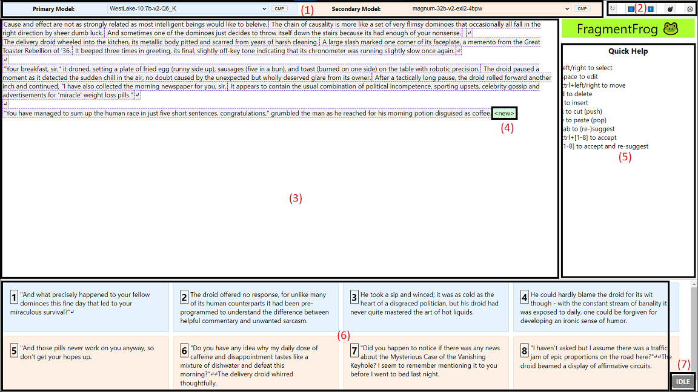

# 🐸 FragmentFrog

FragmentFrog is a non-linear AI-enabled text editing enviroment.

It helps compose stories, documents, emails, or any other text quickly by selecting between suggestions generated by multiple LLMs.

## Overview

1. Model Selection - Pick the Primary and Secondary model for suggestions.
   Hint: You can use [llproxy](https://github.com/the-crypt-keeper/llproxy) to merge models from multiple servers and across providers

2. Control Panel

   - ↻ - Reload model list
   - ⬇️ - Download (Export)
   - ⬆️ - Upload (Import)
   - 💣 - Reset
   - ⚙️ - Settings

3. Fragment list

4. Current selected fragment is highlighted in green, press `<Tab>` to get a suggestion completion for this fragment from the two selected models.

5. Quick Help / Clipboard - Non-linear editing features

6. Suggestion list - Press the number to insert suggestion at the highlighted point and automatically get new suggestions. Hold `<Ctrl>` to avoid the automatic re-suggest.

7. LLM Status indicator

   - IDLE: Nothing in progress
   - WAITING: Request sent
   - RUNNING: Completion in progress

## Concepts

- **Fragment**: A small piece of text, usually but not necessarily a sentence.
- **Fragment list**: A list of fragments that, when joined together, forms the current document.
- **Selected fragment**: The index of the currently selected fragment in the list.
- **Document**: The fragment list joined into a single string without introducing any additional whitespace.
- **Clipboard**: A list of tepmorary fragments with FIFO semantics to enable non-linear editing.
- **Mode**: The current editor mode: "explore" (default), "edit", or "insert".
- **Suggestion List**: A list of AI-generated suggestions for continuing the text.

## Running

- `node -v` should be `v20.15.1`
- `npm ci`
- create `.env`
    - `REACT_APP_OPENAI_API_ENDPOINT=...`
    - `REACT_APP_OPENAI_API_KEY=...`
- `npm run start`

## Keyboard Controls

### Explore Mode (Default)
- Left/Right Arrows: Change selected fragment
- CTRL+Left/Right Arrows: Moved the currently selected fragment left or right
- Space: Edits the selected fragment
- 'i': Insert a new fragment after selected fragment
- 'd': Deletes the selected fragment
- 'x': Cuts the selected fragment, placing it at the end of the Clipboard
- 'v': Pastes the top element from the clipboard
- Tab: Generate new suggestions
- 1-8: Insert the corresponding suggestion after the selected fragment
- Ctrl + 1-8: Insert the corresponding suggestion without automatically generating new suggestions

### Edit/Insert Mode
- Ctrl+Enter: Insert a newline
- Enter: Save changes and return to explore mode
- Escape: Discard changes (edit mode) or delete inserted fragment (insert mode) and return to explore mode

## Getting Started

1. Clone the repository
2. Install dependencies: `npm install`
3. Ensure you have created a `.env` or otherwise set `REACT_APP_OPENAI_API_ENDPOINT` to point to the root of your OpenAI proxy
4. Start the development server: `npm start`
5. Open [http://localhost:3000](http://localhost:3000) in your browser

## LLM Suggestion List

The Suggestion List is an AI-powered feature that provides contextual suggestions for continuing your text. Here's how it works:

1. In Explore mode, press Tab to generate new suggestions based on the current context.
2. Four suggestions will appear in the suggestion panel at the bottom of the interface.
3. To insert a suggestion after the currently selected fragment, press the corresponding number key.
4. By default, new suggestions will be generated automatically after inserting a suggestion.
5. To insert a suggestion without generating new ones, hold Ctrl while pressing the number key.

The suggestion list helps you overcome writer's block and provides creative ideas for continuing your text!

## License

This project is open source and available under the [MIT License](LICENSE).

Happy frogging! 🐸

## TODO

- export document .txt
- track which LLMs fragments came from and render them in corresponding colors
- track which fragments have been edited and indicate it with a border style
- sessions with backend