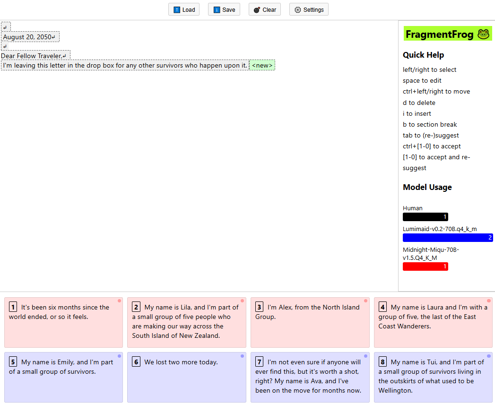

# 🐸 FragmentFrog2

FragmentFrog is a non-linear AI-enabled text editing environment.

It helps compose stories, documents, emails, or any other text quickly by selecting between suggestions generated by multiple LLMs.


:construction: WARNING :construction: This software is under heavy development, and there is no guarantee that Saves are foward-compatible.

## Overview



:construction: Out of date :construction:

1. Model Selection - Pick models and configure their parameters in Settings
2. Control Panel
   - ⬇️ - Download (Export)
   - ⬆️ - Upload (Import)
   - 💣 - Reset
   - ⚙️ - Settings
3. Fragment list
4. Current selected fragment is highlighted in green, press `<Tab>` to get suggestions for this fragment from configured models.
5. Quick Help / Clipboard - Non-linear editing features
6. Suggestion Grid - Press the number to insert suggestion at the highlighted point and automatically get new suggestions. Hold `<Ctrl>` to avoid the automatic re-suggest.
7. LLM Status indicators - Shows status for each configured model

## Architecture

### Core Components

- **Editor**: Manages the document state and fragment manipulation
  - FragmentList: Renders and handles interaction with fragments
  - Fragment: Individual text fragment component
  - Controls: Document-level operations

- **LLM Integration**: Handles AI model interaction
  - SuggestionGrid: Flexible grid layout for model outputs
  - LLMService: Manages API communication with language models
  - ModelConfig: Configuration for individual models

### State Management

The application uses Redux for state management with two main slices:

1. **Editor Slice**
   - Fragment management
   - Selection state
   - Edit/Insert modes
   
2. **LLM Slice**
   - System configuration (grid layout, system prompt)
   - Model configurations
   - Suggestion tracking
   - Model status tracking

### Storage

- **Document Storage**: JSON-based document export/import
- **Settings Storage**: Local storage for system and model configurations

### Configuration

The system supports flexible configuration of:
- Grid layout (1-3 rows, 2-5 columns)
- Multiple models with individual:
  - Sampling settings
  - Completion counts
  - Visual styling

## Running

- `node -v` should be `v20.15.1`
- `npm ci`
- create `.env`
    - `REACT_APP_OPENAI_API_ENDPOINT=...`
    - `REACT_APP_OPENAI_API_KEY=...`
- `npm run start`

## Keyboard Controls

### Explore Mode (Default)
- Left/Right Arrows: Change selected fragment
- CTRL+Left/Right Arrows: Moved the currently selected fragment left or right
- Space: Edits the selected fragment
- 'i': Insert a new fragment after selected fragment
- 'd': Deletes the selected fragment
- 'x': Cuts the selected fragment, placing it at the end of the Clipboard
- 'v': Pastes the top element from the clipboard
- Tab: Generate new suggestions
- 1-8: Insert the corresponding suggestion after the selected fragment [TODO: expand to 1-0]
- Ctrl + 1-8: Insert the corresponding suggestion without automatically generating new suggestions [TODO: expand to 1-0]

### Edit/Insert Mode
- Ctrl+Enter: Insert a newline
- Enter: Save changes and return to explore mode
- Escape: Discard changes (edit mode) or delete inserted fragment (insert mode) and return to explore mode

## Development

### Project Structure

The project follows a flat component structure with clear separation of concerns:

```
src/
  App.tsx            # Root application component
  index.tsx          # Application entry point
  styles/            # Application level theming and styling
  components/        # React components
    ControlBar       # Document-level operations (save/load/clear/settings)
    Fragment         # Individual text fragment rendering and editing
    FragmentList     # Container managing fragments and selection
    SettingsModal    # Configuration UI for models and system settings
    SuggestionList   # Grid display of model completions
  hooks/             # Custom React hooks
    redux.ts         # Type-safe Redux hooks
    useCompletion.ts # LLM completion generation hook
    useKeyboardControls.ts # Keyboard interaction manager
  services/          # External service integration
    llm.ts           # Language model API communication
    storage.ts       # Document import/export
    localStorage.ts  # Settings persistence
  store/             # Redux state management
    slices/
      editor.ts      # Document and editing state
      llm.ts         # Model configuration and completion state
  types/             # TypeScript type definitions
    editor.ts        # Editor-related types
    llm.ts           # LLM-related types
```

Each component has a focused responsibility:
- **App**: Root component managing layout and keyboard focus
- **ControlBar**: Provides document-level operations like save/load/clear and settings access
- **Fragment**: Renders individual text fragments with editing capabilities
- **FragmentList**: Manages the document structure and fragment selection
- **SettingsModal**: Complex form for configuring system and model parameters
- **SuggestionList**: Displays the grid of model completions with status indicators

### Hooks
The application uses custom hooks to manage complex behaviors:

- **redux.ts**: Type-safe hooks for Redux integration
  - `useAppDispatch`: Typed dispatch hook for actions
  - `useAppSelector`: Typed selector hook for state access

- **useCompletion**: Manages LLM completion generation
  - Handles multiple model requests concurrently
  - Manages abort controllers for cancellation
  - Updates model status and suggestions in store

- **useKeyboardControls**: Central keyboard interaction manager
  - Handles all keyboard shortcuts
  - Manages mode-specific behaviors (explore/edit/insert)
  - Controls suggestion insertion and generation
  - Coordinates fragment manipulation (move/delete/edit)

### Testing

The project includes comprehensive tests for:
- Redux reducers
- Fragment manipulation logic
- LLM integration [TODO]
- Configuration management [TODO]

Run tests with: `npm run test:coverage`

## License

This project is open source and available under the [MIT License](LICENSE).

Happy frogging! 🐸
